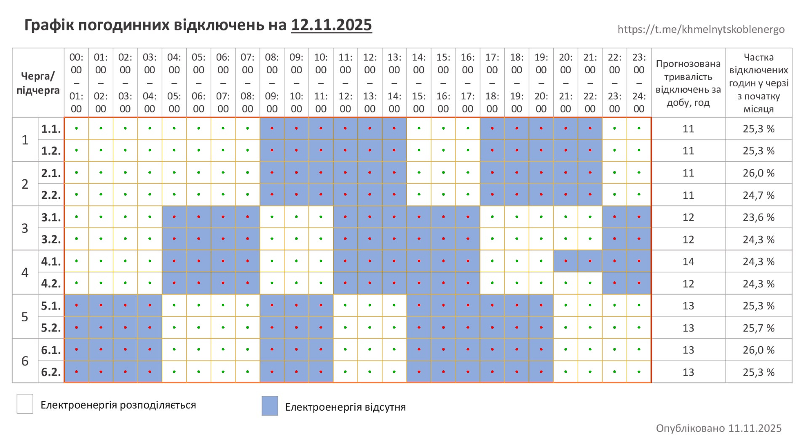
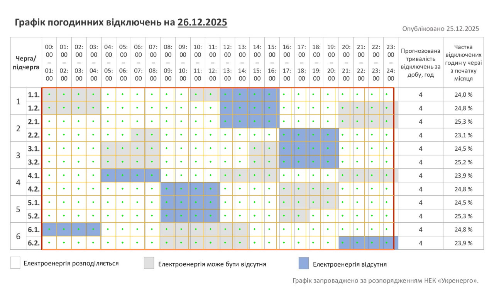
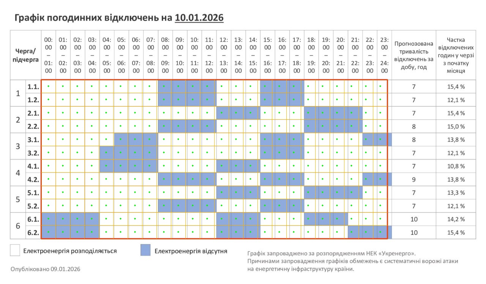
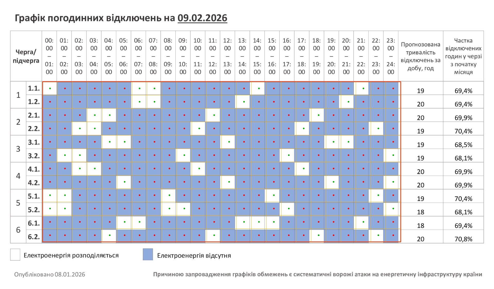
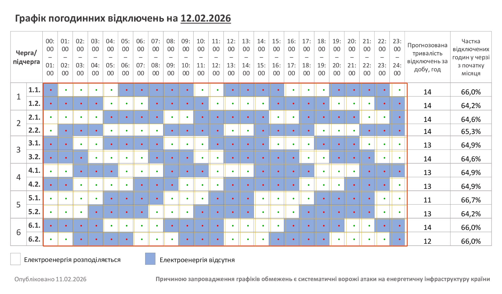
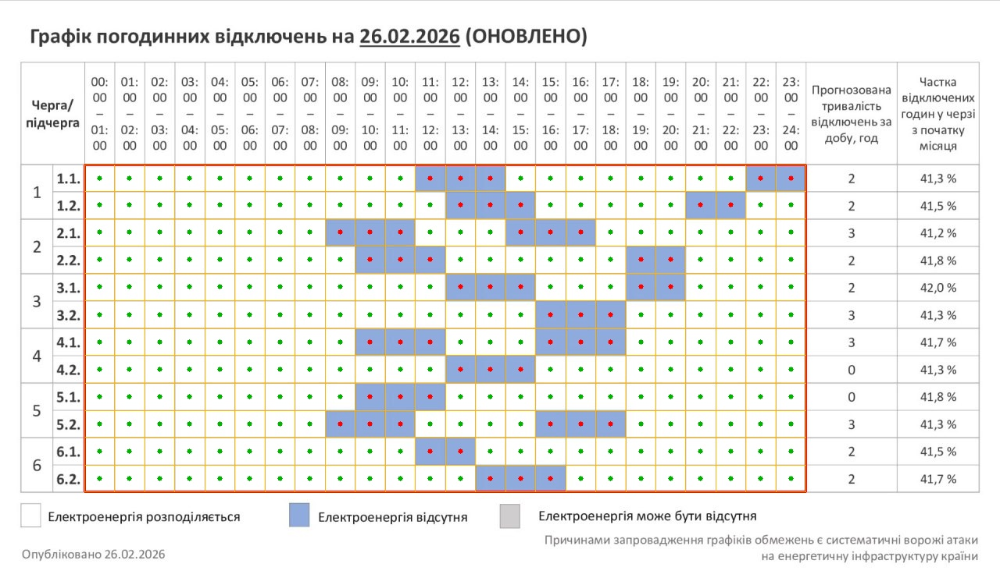
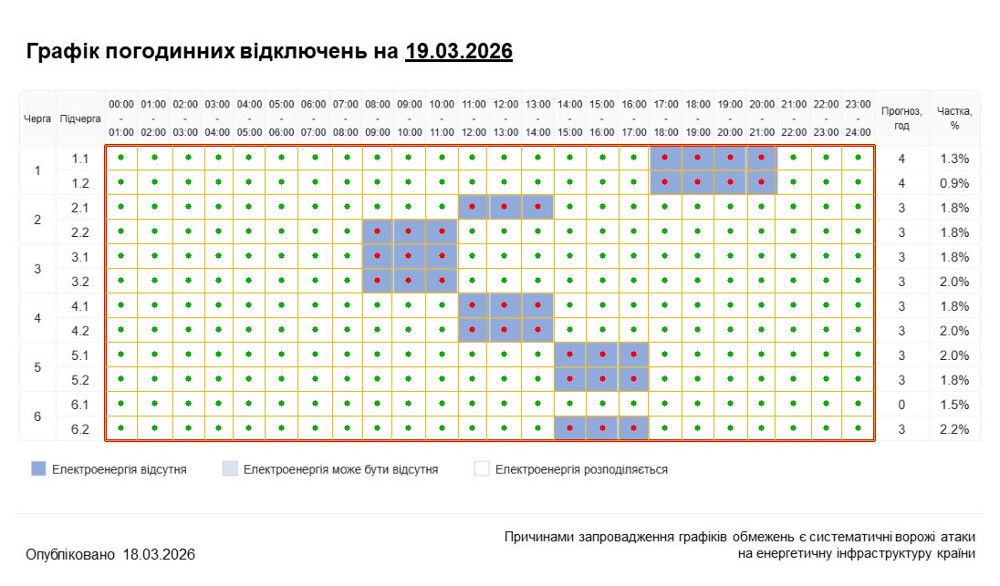

# Electro Parse Report

Source directory: `images`

## photo_2025-12-11.jpeg



<details>
<summary>Показати розпізнані дані</summary>

```json
{
  "1.1": {
    "off": ["08:00", "09:00", "10:00", "11:00", "12:00", "13:00", "17:00", "18:00", "19:00", "20:00", "21:00"],
    "maybe_off": []
  },
  "1.2": {
    "off": ["08:00", "09:00", "10:00", "11:00", "12:00", "13:00", "17:00", "18:00", "19:00", "20:00", "21:00"],
    "maybe_off": []
  },
  "2.1": {
    "off": ["08:00", "09:00", "10:00", "11:00", "12:00", "13:00", "17:00", "18:00", "19:00", "20:00", "21:00"],
    "maybe_off": []
  },
  "2.2": {
    "off": ["08:00", "09:00", "10:00", "11:00", "12:00", "13:00", "17:00", "18:00", "19:00", "20:00", "21:00"],
    "maybe_off": []
  },
  "3.1": {
    "off": ["04:00", "05:00", "06:00", "07:00", "11:00", "12:00", "13:00", "14:00", "15:00", "16:00", "22:00", "23:00"],
    "maybe_off": []
  },
  "3.2": {
    "off": ["04:00", "05:00", "06:00", "07:00", "11:00", "12:00", "13:00", "14:00", "15:00", "16:00", "22:00", "23:00"],
    "maybe_off": []
  },
  "4.1": {
    "off": ["04:00", "05:00", "06:00", "07:00", "11:00", "12:00", "13:00", "14:00", "15:00", "16:00", "20:00", "21:00", "22:00", "23:00"],
    "maybe_off": []
  },
  "4.2": {
    "off": ["04:00", "05:00", "06:00", "07:00", "11:00", "12:00", "13:00", "14:00", "15:00", "16:00", "22:00", "23:00"],
    "maybe_off": []
  },
  "5.1": {
    "off": ["00:00", "01:00", "02:00", "03:00", "08:00", "09:00", "10:00", "14:00", "15:00", "16:00", "17:00", "18:00", "19:00"],
    "maybe_off": []
  },
  "5.2": {
    "off": ["00:00", "01:00", "02:00", "03:00", "08:00", "09:00", "10:00", "14:00", "15:00", "16:00", "17:00", "18:00", "19:00"],
    "maybe_off": []
  },
  "6.1": {
    "off": ["00:00", "01:00", "02:00", "03:00", "08:00", "09:00", "10:00", "14:00", "15:00", "16:00", "17:00", "18:00", "19:00"],
    "maybe_off": []
  },
  "6.2": {
    "off": ["00:00", "01:00", "02:00", "03:00", "08:00", "09:00", "10:00", "14:00", "15:00", "16:00", "17:00", "18:00", "19:00"],
    "maybe_off": []
  }
}
```
</details>

## photo_2025-12-26.jpeg



<details>
<summary>Показати розпізнані дані</summary>

```json
{
  "1.1": {
    "off": ["12:00", "13:00", "14:00", "15:00"],
    "maybe_off": ["00:00", "01:00", "02:00", "03:00", "10:00", "11:00"]
  },
  "1.2": {
    "off": ["12:00", "13:00", "14:00", "15:00"],
    "maybe_off": ["00:00", "01:00", "02:00", "03:00", "20:00", "21:00", "22:00", "23:00"]
  },
  "2.1": {
    "off": ["12:00", "13:00", "14:00", "15:00"],
    "maybe_off": ["20:00", "21:00", "22:00", "23:00"]
  },
  "2.2": {
    "off": ["16:00", "17:00", "18:00", "19:00"],
    "maybe_off": ["06:00", "07:00"]
  },
  "3.1": {
    "off": ["16:00", "17:00", "18:00", "19:00"],
    "maybe_off": ["04:00", "05:00", "06:00", "07:00", "14:00", "15:00"]
  },
  "3.2": {
    "off": ["16:00", "17:00", "18:00", "19:00"],
    "maybe_off": ["04:00", "05:00", "06:00", "07:00", "14:00", "15:00"]
  },
  "4.1": {
    "off": ["04:00", "05:00", "06:00", "07:00"],
    "maybe_off": ["12:00", "13:00", "14:00", "15:00", "20:00", "21:00", "22:00", "23:00"]
  },
  "4.2": {
    "off": ["08:00", "09:00", "10:00", "11:00"],
    "maybe_off": ["16:00", "17:00", "18:00", "19:00"]
  },
  "5.1": {
    "off": ["08:00", "09:00", "10:00", "11:00"],
    "maybe_off": ["16:00", "17:00", "18:00", "19:00"]
  },
  "5.2": {
    "off": ["08:00", "09:00", "10:00", "11:00"],
    "maybe_off": ["16:00", "17:00"]
  },
  "6.1": {
    "off": ["00:00", "01:00", "02:00", "03:00"],
    "maybe_off": ["08:00", "09:00", "10:00", "11:00", "12:00", "13:00"]
  },
  "6.2": {
    "off": ["20:00", "21:00", "22:00", "23:00"],
    "maybe_off": ["08:00", "09:00", "10:00", "11:00", "12:00", "13:00"]
  }
}
```
</details>

## photo_2026-01-10.jpeg



<details>
<summary>Показати розпізнані дані</summary>

```json
{
  "1.1": {
    "off": ["08:00", "09:00", "10:00", "11:00", "15:00", "16:00", "17:00"],
    "maybe_off": []
  },
  "1.2": {
    "off": ["08:00", "09:00", "10:00", "11:00", "15:00", "16:00", "17:00"],
    "maybe_off": []
  },
  "2.1": {
    "off": ["12:00", "13:00", "14:00", "18:00", "19:00", "20:00", "21:00"],
    "maybe_off": []
  },
  "2.2": {
    "off": ["08:00", "09:00", "10:00", "11:00", "18:00", "19:00", "20:00", "21:00"],
    "maybe_off": []
  },
  "3.1": {
    "off": ["05:00", "06:00", "07:00", "15:00", "16:00", "17:00", "22:00", "23:00"],
    "maybe_off": []
  },
  "3.2": {
    "off": ["04:00", "05:00", "06:00", "07:00", "15:00", "16:00", "17:00"],
    "maybe_off": []
  },
  "4.1": {
    "off": ["04:00", "05:00", "06:00", "07:00", "12:00", "13:00", "14:00"],
    "maybe_off": []
  },
  "4.2": {
    "off": ["08:00", "09:00", "10:00", "11:00", "15:00", "16:00", "17:00", "22:00", "23:00"],
    "maybe_off": []
  },
  "5.1": {
    "off": ["12:00", "13:00", "14:00", "18:00", "19:00", "20:00", "21:00"],
    "maybe_off": []
  },
  "5.2": {
    "off": ["08:00", "09:00", "10:00", "11:00", "15:00", "16:00", "17:00"],
    "maybe_off": []
  },
  "6.1": {
    "off": ["00:00", "01:00", "02:00", "03:00", "12:00", "13:00", "14:00", "18:00", "19:00", "20:00"],
    "maybe_off": []
  },
  "6.2": {
    "off": ["00:00", "01:00", "02:00", "03:00", "12:00", "13:00", "14:00", "21:00", "22:00", "23:00"],
    "maybe_off": []
  }
}
```
</details>

## photo_2026-02-08.jpeg


<details>
<summary>Показати розпізнані дані</summary>

```json
{
  "1.1": {
    "off": ["01:00", "02:00", "03:00", "04:00", "05:00", "08:00", "09:00", "10:00", "11:00", "12:00", "13:00", "15:00", "16:00", "17:00", "18:00", "19:00", "20:00", "22:00", "23:00"],
    "maybe_off": []
  },
  "1.2": {
    "off": ["00:00", "01:00", "02:00", "03:00", "04:00", "05:00", "08:00", "09:00", "10:00", "11:00", "12:00", "14:00", "15:00", "16:00", "17:00", "18:00", "19:00", "21:00", "22:00", "23:00"],
    "maybe_off": []
  },
  "2.1": {
    "off": ["00:00", "01:00", "02:00", "05:00", "06:00", "07:00", "08:00", "09:00", "10:00", "12:00", "13:00", "14:00", "15:00", "16:00", "17:00", "19:00", "20:00", "21:00", "22:00", "23:00"],
    "maybe_off": []
  },
  "2.2": {
    "off": ["00:00", "01:00", "04:00", "05:00", "06:00", "07:00", "08:00", "09:00", "11:00", "12:00", "13:00", "14:00", "15:00", "16:00", "18:00", "19:00", "20:00", "21:00", "23:00"],
    "maybe_off": []
  },
  "3.1": {
    "off": ["00:00", "01:00", "02:00", "03:00", "06:00", "07:00", "08:00", "09:00", "10:00", "11:00", "13:00", "14:00", "15:00", "16:00", "17:00", "18:00", "21:00", "22:00", "23:00"],
    "maybe_off": []
  },
  "3.2": {
    "off": ["00:00", "03:00", "04:00", "05:00", "06:00", "07:00", "08:00", "10:00", "11:00", "12:00", "13:00", "14:00", "15:00", "17:00", "18:00", "19:00", "20:00", "21:00", "22:00"],
    "maybe_off": []
  },
  "4.1": {
    "off": ["00:00", "01:00", "04:00", "05:00", "06:00", "07:00", "08:00", "09:00", "11:00", "12:00", "13:00", "14:00", "15:00", "16:00", "18:00", "19:00", "20:00", "21:00", "22:00", "23:00"],
    "maybe_off": []
  },
  "4.2": {
    "off": ["00:00", "01:00", "02:00", "03:00", "04:00", "06:00", "07:00", "08:00", "09:00", "10:00", "11:00", "13:00", "14:00", "15:00", "16:00", "17:00", "18:00", "20:00", "21:00", "22:00"],
    "maybe_off": []
  },
  "5.1": {
    "off": ["02:00", "03:00", "04:00", "05:00", "06:00", "07:00", "09:00", "10:00", "11:00", "12:00", "13:00", "14:00", "16:00", "17:00", "18:00", "19:00", "20:00", "21:00", "23:00"],
    "maybe_off": []
  },
  "5.2": {
    "off": ["02:00", "03:00", "04:00", "05:00", "06:00", "07:00", "10:00", "11:00", "12:00", "13:00", "14:00", "15:00", "17:00", "18:00", "19:00", "20:00", "21:00", "22:00"],
    "maybe_off": []
  },
  "6.1": {
    "off": ["00:00", "01:00", "02:00", "03:00", "04:00", "07:00", "08:00", "09:00", "10:00", "11:00", "12:00", "16:00", "17:00", "18:00", "19:00", "20:00", "22:00", "23:00"],
    "maybe_off": []
  },
  "6.2": {
    "off": ["00:00", "01:00", "02:00", "03:00", "05:00", "06:00", "07:00", "08:00", "09:00", "10:00", "12:00", "13:00", "14:00", "15:00", "16:00", "17:00", "19:00", "20:00", "21:00", "23:00"],
    "maybe_off": []
  }
}
```
</details>

## photo_2026-02-09.jpeg



<details>
<summary>Показати розпізнані дані</summary>

```json
{
  "1.1": {
    "off": ["01:00", "02:00", "03:00", "04:00", "05:00", "08:00", "09:00", "10:00", "11:00", "12:00", "13:00", "15:00", "16:00", "17:00", "18:00", "19:00", "20:00", "22:00", "23:00"],
    "maybe_off": []
  },
  "1.2": {
    "off": ["00:00", "01:00", "02:00", "03:00", "04:00", "05:00", "08:00", "09:00", "10:00", "11:00", "12:00", "14:00", "15:00", "16:00", "17:00", "18:00", "19:00", "21:00", "22:00", "23:00"],
    "maybe_off": []
  },
  "2.1": {
    "off": ["00:00", "01:00", "02:00", "05:00", "06:00", "07:00", "08:00", "09:00", "10:00", "12:00", "13:00", "14:00", "15:00", "16:00", "17:00", "19:00", "20:00", "21:00", "22:00", "23:00"],
    "maybe_off": []
  },
  "2.2": {
    "off": ["00:00", "01:00", "04:00", "05:00", "06:00", "07:00", "08:00", "09:00", "11:00", "12:00", "13:00", "14:00", "15:00", "16:00", "18:00", "19:00", "20:00", "21:00", "23:00"],
    "maybe_off": []
  },
  "3.1": {
    "off": ["00:00", "01:00", "02:00", "03:00", "06:00", "07:00", "08:00", "09:00", "10:00", "11:00", "13:00", "14:00", "15:00", "16:00", "17:00", "18:00", "21:00", "22:00", "23:00"],
    "maybe_off": []
  },
  "3.2": {
    "off": ["00:00", "03:00", "04:00", "05:00", "06:00", "07:00", "08:00", "10:00", "11:00", "12:00", "13:00", "14:00", "15:00", "17:00", "18:00", "19:00", "20:00", "21:00", "22:00"],
    "maybe_off": []
  },
  "4.1": {
    "off": ["00:00", "01:00", "04:00", "05:00", "06:00", "07:00", "08:00", "09:00", "11:00", "12:00", "13:00", "14:00", "15:00", "16:00", "18:00", "19:00", "20:00", "21:00", "22:00", "23:00"],
    "maybe_off": []
  },
  "4.2": {
    "off": ["00:00", "01:00", "02:00", "03:00", "04:00", "06:00", "07:00", "08:00", "09:00", "10:00", "11:00", "13:00", "14:00", "15:00", "16:00", "17:00", "18:00", "20:00", "21:00", "22:00"],
    "maybe_off": []
  },
  "5.1": {
    "off": ["02:00", "03:00", "04:00", "05:00", "06:00", "07:00", "09:00", "10:00", "11:00", "12:00", "13:00", "14:00", "16:00", "17:00", "18:00", "19:00", "20:00", "21:00", "23:00"],
    "maybe_off": []
  },
  "5.2": {
    "off": ["02:00", "03:00", "04:00", "05:00", "06:00", "07:00", "10:00", "11:00", "12:00", "13:00", "14:00", "15:00", "17:00", "18:00", "19:00", "20:00", "21:00", "22:00"],
    "maybe_off": []
  },
  "6.1": {
    "off": ["00:00", "01:00", "02:00", "03:00", "04:00", "07:00", "08:00", "09:00", "10:00", "11:00", "12:00", "16:00", "17:00", "18:00", "19:00", "20:00", "22:00", "23:00"],
    "maybe_off": []
  },
  "6.2": {
    "off": ["00:00", "01:00", "02:00", "03:00", "05:00", "06:00", "07:00", "08:00", "09:00", "10:00", "12:00", "13:00", "14:00", "15:00", "16:00", "17:00", "19:00", "20:00", "21:00", "23:00"],
    "maybe_off": []
  }
}
```
</details>

## photo_2026-02-12.jpeg



<details>
<summary>Показати розпізнані дані</summary>

```json
{
  "1.1": {
    "off": ["00:00", "05:00", "06:00", "07:00", "08:00", "09:00", "12:00", "13:00", "14:00", "15:00", "19:00", "20:00", "21:00", "22:00"],
    "maybe_off": []
  },
  "1.2": {
    "off": ["00:00", "01:00", "02:00", "03:00", "07:00", "08:00", "09:00", "10:00", "15:00", "16:00", "17:00", "18:00", "22:00", "23:00"],
    "maybe_off": []
  },
  "2.1": {
    "off": ["04:00", "05:00", "06:00", "07:00", "10:00", "11:00", "12:00", "13:00", "14:00", "17:00", "18:00", "19:00", "20:00", "23:00"],
    "maybe_off": []
  },
  "2.2": {
    "off": ["01:00", "02:00", "03:00", "08:00", "09:00", "10:00", "11:00", "14:00", "15:00", "16:00", "17:00", "21:00", "22:00", "23:00"],
    "maybe_off": []
  },
  "3.1": {
    "off": ["00:00", "01:00", "04:00", "05:00", "06:00", "07:00", "11:00", "12:00", "13:00", "14:00", "18:00", "19:00", "20:00"],
    "maybe_off": []
  },
  "3.2": {
    "off": ["00:00", "01:00", "02:00", "07:00", "08:00", "09:00", "12:00", "13:00", "14:00", "15:00", "16:00", "19:00", "20:00", "21:00"],
    "maybe_off": []
  },
  "4.1": {
    "off": ["02:00", "03:00", "04:00", "08:00", "09:00", "10:00", "14:00", "15:00", "16:00", "17:00", "21:00", "22:00", "23:00"],
    "maybe_off": []
  },
  "4.2": {
    "off": ["00:00", "01:00", "06:00", "07:00", "08:00", "12:00", "13:00", "14:00", "15:00", "16:00", "20:00", "21:00", "22:00"],
    "maybe_off": []
  },
  "5.1": {
    "off": ["04:00", "05:00", "06:00", "07:00", "11:00", "12:00", "13:00", "18:00", "19:00", "20:00", "21:00"],
    "maybe_off": []
  },
  "5.2": {
    "off": ["03:00", "04:00", "05:00", "06:00", "10:00", "11:00", "12:00", "13:00", "17:00", "18:00", "19:00", "20:00", "21:00"],
    "maybe_off": []
  },
  "6.1": {
    "off": ["00:00", "01:00", "02:00", "03:00", "08:00", "09:00", "10:00", "11:00", "16:00", "17:00", "18:00", "19:00", "22:00", "23:00"],
    "maybe_off": []
  },
  "6.2": {
    "off": ["02:00", "03:00", "04:00", "05:00", "09:00", "10:00", "11:00", "15:00", "16:00", "17:00", "18:00", "23:00"],
    "maybe_off": []
  }
}
```
</details>

## photo_2026-02-26.jpeg



<details>
<summary>Показати розпізнані дані</summary>

```json
{
  "1.1": {
    "off": ["11:00", "12:00", "13:00", "22:00", "23:00"],
    "maybe_off": []
  },
  "1.2": {
    "off": ["12:00", "13:00", "14:00", "20:00", "21:00"],
    "maybe_off": []
  },
  "2.1": {
    "off": ["08:00", "09:00", "10:00", "14:00", "15:00", "16:00"],
    "maybe_off": []
  },
  "2.2": {
    "off": ["09:00", "10:00", "11:00", "18:00", "19:00"],
    "maybe_off": []
  },
  "3.1": {
    "off": ["12:00", "13:00", "14:00", "18:00", "19:00"],
    "maybe_off": []
  },
  "3.2": {
    "off": ["15:00", "16:00", "17:00"],
    "maybe_off": []
  },
  "4.1": {
    "off": ["09:00", "10:00", "11:00", "15:00", "16:00", "17:00"],
    "maybe_off": []
  },
  "4.2": {
    "off": ["12:00", "13:00", "14:00"],
    "maybe_off": []
  },
  "5.1": {
    "off": ["09:00", "10:00", "11:00"],
    "maybe_off": []
  },
  "5.2": {
    "off": ["08:00", "09:00", "10:00", "15:00", "16:00", "17:00"],
    "maybe_off": []
  },
  "6.1": {
    "off": ["11:00", "12:00"],
    "maybe_off": []
  },
  "6.2": {
    "off": ["13:00", "14:00", "15:00"],
    "maybe_off": []
  }
}
```
</details>

## photo_2026-03-19.jpeg



<details>
<summary>Показати розпізнані дані</summary>

```json
{
  "1.1": {
    "off": ["17:00", "18:00", "19:00", "20:00"],
    "maybe_off": []
  },
  "1.2": {
    "off": ["17:00", "18:00", "19:00", "20:00"],
    "maybe_off": []
  },
  "2.1": {
    "off": ["11:00", "12:00", "13:00"],
    "maybe_off": []
  },
  "2.2": {
    "off": ["08:00", "09:00", "10:00"],
    "maybe_off": []
  },
  "3.1": {
    "off": ["08:00", "09:00", "10:00"],
    "maybe_off": []
  },
  "3.2": {
    "off": ["08:00", "09:00", "10:00"],
    "maybe_off": []
  },
  "4.1": {
    "off": ["11:00", "12:00", "13:00"],
    "maybe_off": []
  },
  "4.2": {
    "off": ["11:00", "12:00", "13:00"],
    "maybe_off": []
  },
  "5.1": {
    "off": ["14:00", "15:00", "16:00"],
    "maybe_off": []
  },
  "5.2": {
    "off": ["14:00", "15:00", "16:00"],
    "maybe_off": []
  },
  "6.1": {
    "off": [],
    "maybe_off": []
  },
  "6.2": {
    "off": ["14:00", "15:00", "16:00"],
    "maybe_off": []
  }
}
```
</details>
